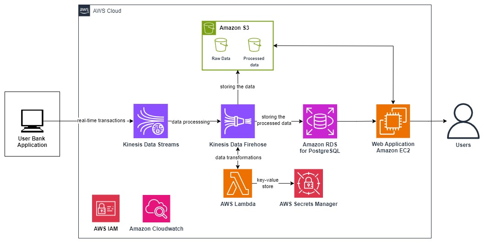

# Real-Time Expense Tracker

## Team Information
- **Team Members:**
  - Sai Krishna Sriram, MS in Data Science, University of Colordo Boulder
  - Sai Pratheek KVDSNK, MS in Data Science, University of Colordo Boulder

---

## Project Overview
This Real-Time Expense Tracker is a cloud-native application that allows users to:
- Monitor and manage their expenses effectively.
- Visualize expense trends and category-wise comparisons through an interactive dashboard.
- Upload important receipts securely to prevent misplacement.
- Add expenses manually for accurate tracking.

The project leverages AWS services to ensure real-time data processing, secure storage, and scalable performance.

---

## Project Demo

Watch the complete demo of our Real-Time Expense Tracker on YouTube:

[](https://youtu.be/rrnqwVJVfyQ)

Click the image or [here](https://youtu.be/rrnqwVJVfyQ) to watch the video.

---

## Features
- **Real-Time Expense Tracking**: Process transaction data in real time using AWS Kinesis Data Streams and AWS Lambda.
- **Analytics Dashboard**: View insights such as expense trends and category comparisons via React-based visualizations.
- **Secure Receipt Storage**: Store receipts in Amazon S3 for safekeeping and accessibility.
- **Manual Expense Entry**: Add expenses manually to complement receipt uploads.

---

## Architecture Overview
The architecture includes:
- **Data Generation**: An EC2 instance generates synthetic transaction data and streams it to AWS Kinesis Data Streams.
- **Data Processing**: AWS Lambda processes raw data, transforms it, and stores it in Amazon RDS (PostgreSQL) and Amazon S3.
- **Frontend and Backend**: A React frontend and Flask backend hosted on AWS EC2 interact with the database and storage to display and manage user data.
- **Monitoring and Security**: AWS CloudWatch and IAM ensure reliability and security across the application.

Below is the architecture diagram for the application:



---

## Deployment Instructions
Follow these steps to deploy the application:

### Prerequisites
- AWS account with necessary permissions for the following services:
  - Kinesis Data Streams
  - Kinesis Data Firehose
  - Lambda
  - S3
  - RDS (PostgreSQL)
  - Secrets Manager
  - EC2
- Python 3.9 or higher installed locally.
- Node.js 16 or higher installed locally.

### Steps
#### 1. Backend Deployment
1. Clone the repository:
   ```bash
   git clone https://github.com/cu-csci-4253-datacenter-fall-2024/finalproject-real-time-expense-tracker.git
   cd finalproject-real-time-expense-tracker

   ```
2. Set up the PostgreSQL database in Amazon RDS:
   - Run the SQL script `StorageProcedureInsertToRDS.sql` to create necessary tables.
3. Install backend dependencies:
   ```bash
   pip install -r requirements.txt
   ```
4. Deploy the `LambdaDataProcessing.py` file as an AWS Lambda function:
   - Use the AWS Management Console or AWS CLI.
   - Assign IAM roles to Lambda with access to Secrets Manager, S3, and RDS.
5. Update the Flask backend (`app.py`) with your RDS and S3 configurations.
6. Host the backend on an EC2 instance and start the Flask service:
   ```bash
   python app.py
   ```

#### 2. Frontend Deployment
1. Navigate to the React frontend directory:
   ```bash
   cd react_frontend
   ```
2. Install dependencies:
   ```bash
   npm install
   ```
3. Update the `src/config.js` file with API endpoints for the Flask backend.
4. Start the development server locally:
   ```bash
   npm start
   ```
5. For production deployment, build the app:
   ```bash
   npm run build
   ```
   Deploy the build files to an EC2 instance or S3 bucket with static website hosting enabled.

#### 3. Data Generator Deployment
1. Deploy `SimulatedBankDataGeneration.py` on an EC2 instance to generate synthetic transaction data.
2. Configure the script with your Kinesis Data Stream name.
3. Run the script:
   ```bash
   python SimulatedBankDataGeneration.py
   ```

---

## Testing the Application
1. Access the frontend via the deployed URL or localhost during development.
2. Add test expenses manually or upload receipts using the UI.
3. Verify real-time expense updates and visualizations on the dashboard.
4. Monitor logs in AWS CloudWatch to ensure successful data processing.

---

## Additional Information
- **AWS Services Used**:
  - Kinesis Data Streams and Firehose
  - Lambda
  - RDS (PostgreSQL)
  - S3
  - Secrets Manager
  - CloudWatch
  - IAM
- **Languages and Tools**:
  - Backend: Flask (Python)
  - Frontend: React (JavaScript)
  - Data Generation: Python
  - Database: PostgreSQL

---

## Future Work
- Integrate Optical Character Recognition (OCR) using AWS Textract to automatically extract expense details from uploaded receipts.
- Develop a mobile app using React Native or Flutter for seamless access on the go.
- Enhance the analytics dashboard with customizable filters and trend predictions.

Stay Tuned ....

---

## Contact
For any queries, reach out to:
- **Email**: saikrishna.sriam@colorado.edu, saipratheek.kerthivenkata@colorado.edu
- **GitHub Issues**: Use the repository's issue tracker for bug reports or feature requests.

